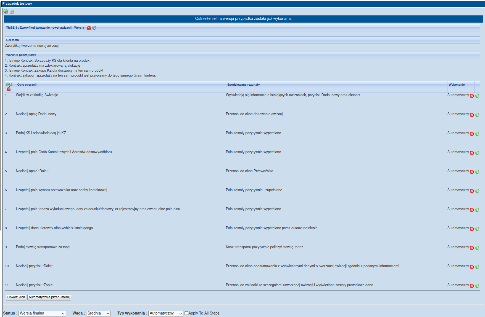

# Selenium - projekt bazowy

### Struktura projektu:
Testy realizowane są w oparciu o wzorzec **Page Object Pattern** (https://testerzy.pl/baza-wiedzy/pageobjectpattern-jak-sprawic-aby-testy-automatyczne-byly-latwiejsze).

W folderze **pages** znajdują się pliki zawierające funkcje dotyczące poszczególnych widoków danej strony internetowej (np. strona logowania, strona głowna itp.). Wyjątkiem są wszelkie menu, headery, footery itp. - z uwagi na to, że zwykle powtarzają się one na wszystkich stronach (lub bardzo wielu) dobrze jest stworzyć dla nich osobny plik zamiast uwzględniać je w pliku każdej ze stron z osobna.

Folder **report** służy do przechowywania plików generowanych przez Allure podczas lokalnego uruchamiania testów.

W folderze **test_data** znajdują się opcjonalnie pliki z danymi niezbędnymi do wykonania niektórych testów (mogą to być zarówno pliki .py zawierające klasy z danymi, jak i standardowe pliki pdf, xls, jpg itp., które przesyłane są do systemu lub z których pobierane sa dane).

Folder **tests** zawiera pliki z testami oraz plik **conftest**, który zawiera funkcje, z których mogą korzystać wszystkie testy (bardzo dobrze wyjaśnione w pierwszej odpowiedzi: https://stackoverflow.com/questions/34466027/in-pytest-what-is-the-use-of-conftest-py-files). Dodatkowo musi być tutaj zawarty plik `__init__.py` inaczej testy nie będą wykrywane (plik ten jest pusty).

W **utils** znajdują sie wszelkie pliki pomocnicze, np. zawierające funkcje do obsługi plików oraz **driver_factory**, który zawiera ustawienia wszystkich obsługiwanych przeglądarek.

Wymagane biblioteki:
- **selenium**
- **pytest**
- **webdriver-manager**         (do uruchamiania instancji przeglądarek)
- **msedge-selenium-tools**	    (od odpalania Egde)
- **allure**                    (generowanie raportów) 
- **pytest-xdist**              (m.in. do równoległego uruchamiania testów - kilka przeglądarek na raz)

Komendy konsolowe do uruchamiania testów:
- **pytest**                                    - uruchamia wszystkie testy, które znajdzie w danym projekcie 
- **pytest -n x**                               - uruchamia testy równolegle na x przeglądarkach
- **pytest -k 'nazwa'**                         - uruchamia wszystkie testy, które w nazwie klasy lub funcji zawierają wyrażenie 'nazwa'
- **pytest -x**                                 - przerywa testy po pierwszej porażce (error/fail)
- **pytest -v**                                 - zwiększa szczegółowość raportu w konsoli
- **pytest --alluredir="ścieżka\do\folderu"**    - uruchamia testy ze wskazaniem folderu, do którego mają zostać wrzucone pliki do wygenerowania raportu w Allure

Komendy Allure:
- **allure serve ścieżka\do\folderu**           - generuje raport na podstawie plików z podanego folderu

### Kursy Udemy:

**Kurs Selenium Python od podstaw (https://www.udemy.com/course/kurs-selenium-python/)** - kurs po polsku, przystępne wprowadzenie do Selenium razem z kursem w Pythona [Python, Selenium, Selenium Grid, Selenium IDE, PyTest, Allure, Page Object Model]

**Selenium Webdriver with PYTHON from Scratch + Frameworks (https://www.udemy.com/course/learn-selenium-automation-in-easy-python-language/)** - kurs po angielsku, podobnie do poprzedniego - wprowadzenie do Selenium razem z Pythonem (dodatkowo moduł o GIT) [Python, Selenium, PyTest]

**Podstawy manualnego testowania oprogramowania (https://www.udemy.com/course/kurs-testowania-oprogramowania/)** - przykładowy kurs dotyczący testowania manualnego

### Przydatne rzeczy:
- Allure - łatwe generowanie przejrzystych raportów z testów z dołączonymi załącznikami (np. screenami wykonanymi w momencie niepowodzenia) (https://docs.qameta.io/allure/)
- logger - zbieranie informacji o przebiegu testów w konsoli w czasie rzeczywistym (https://docs.python.org/3/howto/logging.html)
- Appium + Android Studio - uruchamianie testów na emulatorze Androida (https://appium.io/docs/en/about-appium/getting-started/ - dokumentacja z instrucją i przykładami użycia)
- Chropath - wtyczka do Chrome ułatwiająca szukanie i sprawdzanie poprawności xpathów
- TestLink - narzędzie do przechowywania scenariuszy testowych
- moduł ExpectedConditions - czekanie skryptu na zaistnienie odpowiednich warunków do przeprowadzenia testu (załadowanie się elementu itp.)

Dobre praktyki:
- niezależność testów - w sytuacji idealnej żaden test nie powinien być zależny od innego (ani wykorzystywać tych samych danych) (https://www.selenium.dev/documentation/test_practices/encouraged/test_independency/)
- branie pod uwagę różnic między uruchamianiem testów na Windowsie a Linuxie (szczególnie ważne sprawdzenie poprawności działania testów po wrzuceniu na serwer) - m.in. różnice w ścieżkach do plików

### Scenariusze testowe 

Przed rozpoczęciem pisania testów automatycznych należy przygotować **scenariusze testowe** (a właściwie *przypadki testowe*). Każdy z nich powinien zawierać cel testu, warunki początkowe oraz opis przebiegu testu krok po kroku wraz z oczekiwanymi rezultatami. Każdy test automatyczny odpowiada jednemu scenariuszowi (test nie może sprawdzać równoczeście dwóch scenariuszy, ani wiele testów nie może sprawdzać jednego scenariusza), z pominięciem scenariuszy, których automatyzacja jest niemożliwa.

Przykładowy scenariusz:
